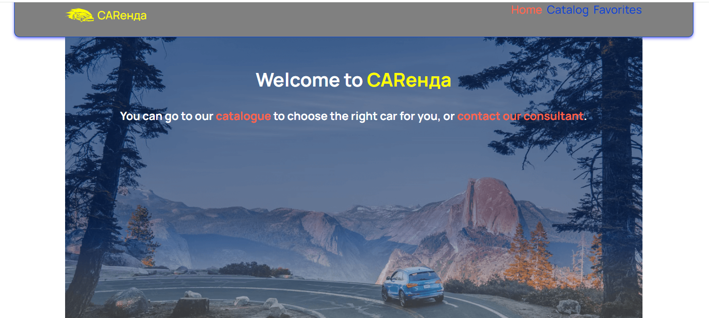

This app has been developed for the purpose of preparing for technical interviews as an initiative of GoIT school.
CARенда is a car hire company. The user can filter the offered cars by 4 parameters. It is also possible to add a favourite car to favourites. It is possible to view more detailed information about the car by clicking on the appropriate button to open a modal window. Pagination is also implemented using the LoarMore button. Thanks to useSearchParams, you can share a link with a friend with the selected filter so that you don't lose the filtering. 
Backend implemented using https://mockapi.io/ 
Application developed with create-react-app 
The following technologies were used to develop the application: 
React 
Redux Toolkit 
Axios 
React Router 
react-icons 
react-toastify 
redux-persist 
styled-components 

